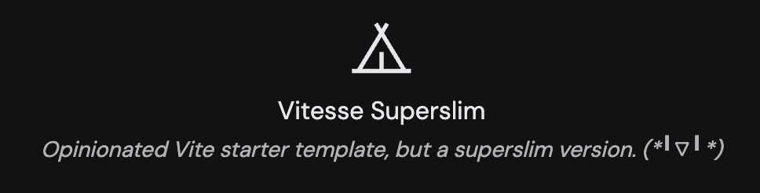

<p align="center">
    
</p>

<h1 align="center">
    Vitesse Superslim
</h1>

<p align="center">
    <b>
        <i>Superslim version of vitesse.</i>
    </b>
</p>

<p align="center">
    Forked from
    <a href="https://github.com/antfu/vitesse-lite" target="_blank">antfu/vitesse-lite</a>
</p>

<p align="center">
    <span>English</span>
    <span style="margin-inline: 5px;">|</span>
    <span>
        <a href="./README.zh-CN.md" target="_blank">简体中文</a>
    </span>
</p>

# Demo

See demo at: [Netlify Demo](https://vitesse-superslim.netlify.app/)

# Features

See [Vitesse-lite](https://github.com/antfu/vitesse-lite).

# Scripts

```shell
# dev
pnpm run dev

# eslint fix
pnpm run lint:fix

# build
pnpm run build
```

# License

[MIT License](./LICENSE)

Copyright (c) 2020-PRESENT Anthony Fu

Copyright (c) 2024-PRESENT Vincent-the-gamer
